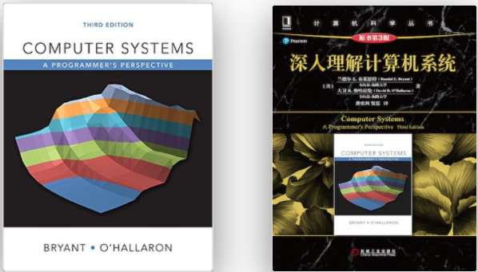

+ [author](https://github.com/3293172751)
# 第1节
+ [回到目录](../README.md)
> ❤️💕💕这是一本难得的可以当作计算机专业权威入门指南的书籍,或者说其中的内容可能会伴随你的整个程序员职业生涯。Myblog:[http://nsddd.top](http://nsddd.top/)
---
[TOC]

## CSAPP介绍

[CS:APP3e](http://csapp.cs.cmu.edu/) 是 Computer Systems: A Programmer’s Perspective的缩写，是卡内基梅隆大学（简称 CMU） 的ICS，也就是计算机导论课程的教材 ，已被全世界范围内的200多所大学用作教材，两位教授分别是 [Randal E. Bryant](https://en.wikipedia.org/wiki/Randal_Bryant) 和 [David R. O’Hallaron](https://www.cs.cmu.edu/~droh/)，该书的简体中文版名称是《深入理解计算机系統》，[豆瓣](https://book.douban.com/subject/26912767/)的评分高达9.8分，其实直译为《从程序员的角度来理解计算机系统》也许更加贴切，因为该书虽然涉及的范围很广但是讲解的内容其实并不算特别深入。

（如果你发现了书中的错误，请联系译者或者出版社，勘误列表：http://www.yiligong.org/csapp3e/）

看完这本书之后你会对计算机底层机制有一个概貌式的理解，实际上它糅合了计算机组成与体系结构，操作系统，链接与装载，程序优化，现代存储器，网络等基础知识，大部分时候，其中的每一章（甚至是一小节）都可以再次扩展成一本书来讲授，因此对于计算机初学者或者非CS专业出身的人来说，它会告诉你，要想成为一名优秀的程序员，你必须理解哪些计算机底层原理，或者说在你今后的自学过程中，应该重点学习哪些课程，换句话说，这是一本难得的可以当作计算机专业权威入门指南的书籍，或者说其中的内容可能会伴随你的整个程序员职业生涯。

虽然今天看起来，大部分的程序员在平时的工作中用到的计算机基础知识可能只占到了大学课程的10%，觉得以前学过的知识都没什么用，比如进程，缓存，DMA等，实际上这仅仅是一种错觉而已，要么是因为你每天都工作在很高的抽象层次上（大部分时候是在写应用程序），要么是因为你没有工作在特定的领域而已（比如设计编译器），像是fork，Copy-On-Write，I/O多路复用等等，实际上你几乎每天都在使用它们，理解了存储器的层次结构，知道了CPU，缓存，内存，硬盘，网络等不同层次之间速度的巨大差异，就能理解很多系统软件的设计的初衷，经常听程序员说一句很有意思的话 “不管了，反正这样改一改代码就正常了，我也不知道为什么”，今天我们已经被太多的抽象或者所谓的框架所包围，但是底层的工作机制依然是支撑它们的基础，最好还是能够 “知其所以然”，主动修炼内功，台湾的侯捷先生也说过类似的话 “勿以浮沙筑高台”，理解计算机系统底层的工作原理可以帮助我们更加正确，高效，安全地使用底层的资源，写出更加健壮的代码，以及比别人更加会调试代码！

## END 链接

+ [回到目录](../README.md)
+ [下一节](2.md)
---
###  **[其他理论课相关的笔记](https://github.com/3293172751/CS_COURSE)**
+ [参与贡献❤️💕💕](https://github.com/3293172751/Block_Chain/blob/master/Git/git-contributor.md)